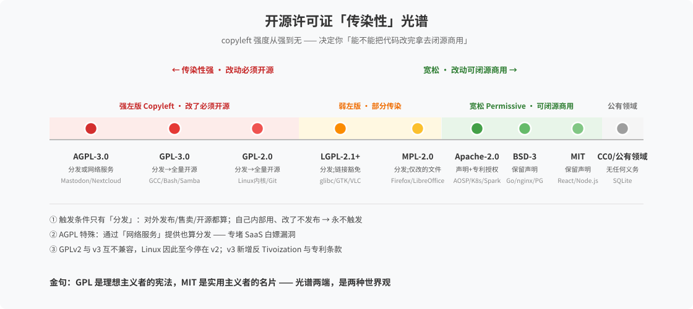
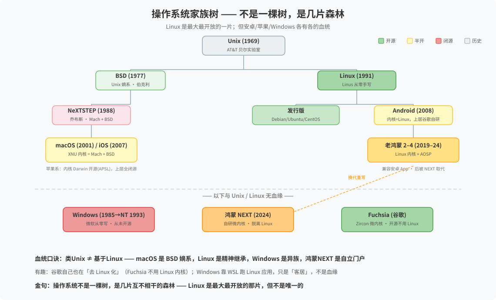

# 开源与操作系统谱系

> 一句话：开源不是二值问题，操作系统也不是一棵树——两张图讲清数字世界的底层格局。
> 来源：2026-08-23 与 Hermes 连续问答沉淀（开源是什么 → 安卓/GMS → 国产手机自主性 → 鸿蒙 → Linux → 许可证）。

## 一、开源许可证「传染性」光谱

| 许可证 | 传染性 | 触发条件 | 修改后再分发的义务 | 代表项目 |
|:------|:------|:--------|:----------------|:--------|
| AGPL-3.0 | 🔴 最强 | 分发 **或** 网络服务 | 整个项目必须开源+同许可 | Mastodon、Nextcloud、MinIO |
| GPL-3.0 | 🔴 强 | 分发 | 整个项目必须开源+同许可 | GCC、Bash、Samba |
| GPL-2.0 | 🔴 强 | 分发 | 整个项目必须开源+同许可 | Linux内核、Git、MySQL |
| LGPL-2.1+ | 🟠 中 | 分发；动态链接豁免 | 库的修改开源，程序可闭源 | glibc、GTK、VLC |
| MPL-2.0 | 🟡 弱 | 分发 | 仅「被改的文件」开源 | Firefox、LibreOffice |
| Apache-2.0 | 🟢 宽松 | 无 | 保留声明+专利授权 | AOSP、K8s、Spark |
| BSD-3 | 🟢 宽松 | 无 | 保留声明 | Go、nginx、PostgreSQL |
| MIT | 🟢 最简 | 无 | 保留声明 | React、Node.js |
| CC0/公有领域 | ⚪ 无 | 无 | 无 | SQLite |

### 关键机制
1. **传染只在「分发」时触发**——内部自用、改了不发布，永不触发（最大误解点）
2. **AGPL 盯 SaaS**：通过网络服务提供也算分发，专堵云时代漏洞
3. **GPLv2 与 v3 互不兼容**，Linux 因此至今停在 v2；v3 新增反 Tivoization 与专利条款
4. **例外条款决定实际传染面**：Linux syscall exception、OpenJDK Classpath exception、LGPL 链接豁免
5. 业务判断三步：**什么许可证 → 改没改 → 分没分发**

## 二、操作系统家族树

### 血统口诀：类 Unix ≠ 基于 Linux
| 系统 | 血统 | 说明 |
|:----|:----|:----|
| macOS/iOS | BSD 嫡系 | BSD(1977)→NeXTSTEP(1988)→macOS(2001)，内核 XNU=Mach+BSD；内核 Darwin 开源(APSL)，上层闭源 |
| Linux | 精神继承 | Linus 1991 从零手写，无 Unix 代码血统，GPLv2 锁死开源 |
| Windows | 异族 | NT 内核(1993)独立谱系，从未开源；WSL 只是「客居」 |
| 鸿蒙 NEXT | 自立门户 | 自研微内核，脱离 Linux |
| Fuchsia | 自立门户 | 谷歌新系统，Zircon 微内核，开源但不用 Linux——谷歌自己在「去 Linux 化」 |

### 安卓的真相
- 只借 **Linux 内核**（GPL 锁死必须公开），上层谷歌自研（Apache 允许闭源）——**地基归地基，楼层归楼层**
- 国产手机 = AOSP 分支 + 厂商定制，与 GMS 无关（国内替身：微信/支付宝/厂商全家桶）
- 「自主」三变量：**可替代性、层级（越底层越难）、单点 vs 多点**

### 鸿蒙的两代
- 老鸿蒙 2–4 = Linux 内核 + AOSP，兼容安卓 App（2019–24）
- 鸿蒙 NEXT = 自研微内核，不兼容 APK，生态从零重建（2024–）
- **曲线独立**：先兼容活下来 → 攒够生态再脱钩（千帆计划 → 微信/支付宝原生版 → 砍 APK）

## 三、核心认知
- **开源解决「看不看得见」，不解决「谁说了算」**——唯一例外：Linux 连治理都部分交给 GPL+社区
- **开源是商业决定不是道德决定**——2020s 开源退潮（SSPL/BSL/Elastic License）：源码可得 ≠ 开源
- 金句：**安卓把开源当策略，Linux 把开源当宪法**；**绕过谷歌只是换了房东，不是有了自己的房子**

## 关联
- [[我的AI观]] —— AI 时代开源 vs 闭源模型，同构问题（黑箱 vs 可审计）
- [[我的体系观]] —— 共治 vs 独治的治理框架
- [[知识库首页]]
