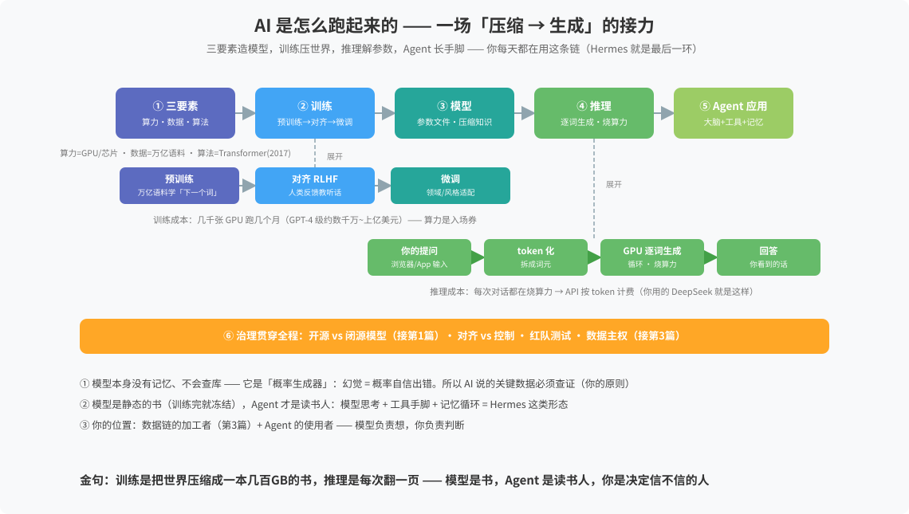

# AI 是怎么跑起来的

> 一句话：AI 不是「机器思考」，是一场「压缩 → 生成」的接力——三要素造模型，训练压世界，推理解参数，Agent 长手脚。
> 来源：2026-08-23 与 Hermes 问答沉淀（数字世界底层常识系列第 4 篇·收官）。

## 全景图

## 六环链

1. **三要素**——算力（GPU/芯片，入场券）+ 数据（万亿语料）+ 算法（Transformer 2017）
2. **训练**——预训练（学「下一个词」= 压缩人类知识）→ 对齐 RLHF（教听话）→ 微调（领域适配）。成本：几千张 GPU 跑数月，数千万~上亿美元
3. **模型**——静态参数文件：没有记忆、不会更新、不会查库（除非接工具/RAG）
4. **推理**——提问 → token 化 → GPU 逐词生成 → 回答。每次对话都烧算力 → API 按 token 计费（DeepSeek 即此模式）
5. **Agent 应用**——模型思考 + 工具手脚 + 记忆 + 循环（Hermes 就是这一环）
6. **治理**——开源 vs 闭源、对齐 vs 控制、红队测试、数据主权

## 两个关键认知

- 模型是**概率生成器不是检索库**：幻觉 = 概率自信出错 → AI 说的关键数据必须查证
- **模型是书，Agent 是读书人**：书再厚不会自己翻页

## 你的位置

数据链的加工者（第 3 篇）+ Agent 的使用者——模型负责想，你负责判断，你站在链条的最后一公里（最贵的一公里）。

金句：**训练是把世界压缩成一本几百GB的书，推理是每次翻一页——模型是书，Agent 是读书人，你是决定信不信的人。**

## 关联
- [[开源与操作系统谱系]] · [[互联网是怎么跑起来的]] · [[数据是怎么流通的]]（系列前篇）
- [[数字世界常识索引]]（簇入口）· [[知识库首页]]
- [[我的AI观]] —— 大脑+手脚架构
