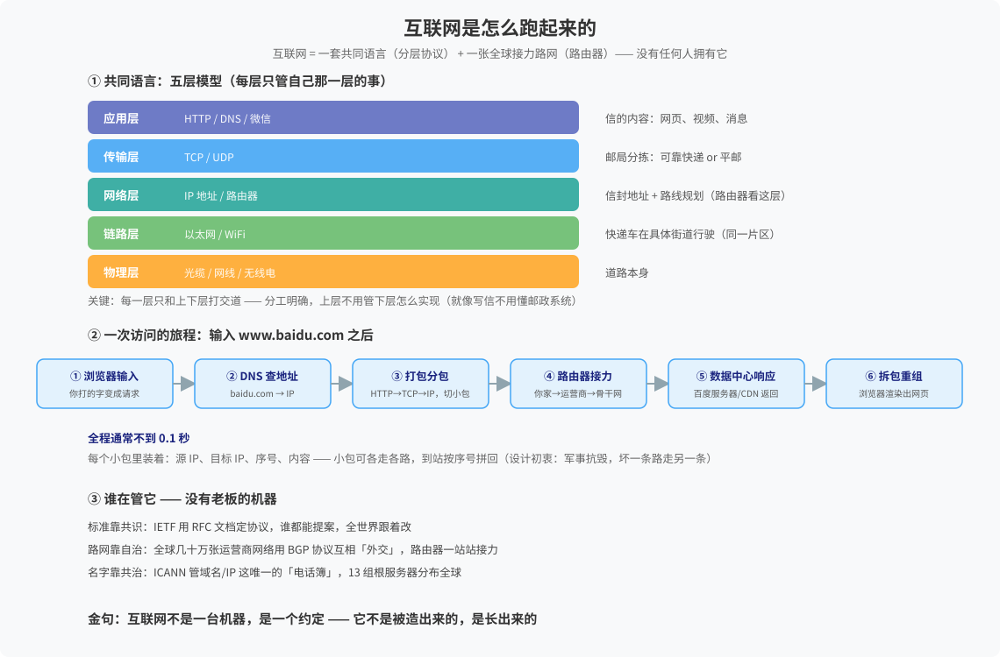

# 互联网是怎么跑起来的

> 一句话：互联网不是一台机器，是一套约定——共同语言（分层协议）+ 全球接力路网（路由器），没有任何人拥有它。
> 来源：2026-08-23 与 Hermes 问答沉淀（数字世界底层常识系列第 2 篇）。

## 全景图

## ① 五层模型（寄快递比喻）

| 层 | 干什么 | 比方 |
|:--|:--|:--|
| 应用层 | 网页/视频/消息格式（HTTP、DNS） | 信的内容 |
| 传输层 | 可靠 or 快速（TCP/UDP） | 邮局分拣 |
| 网络层 | 全球寻址+路线规划（IP、路由器） | 信封地址+选路 |
| 链路层 | 同片区传输（以太网/WiFi） | 快递车跑街道 |
| 物理层 | 光缆/网线/无线电 | 道路本身 |

关键：每层只和上下层打交道，各层独立演进——写信的人不用懂邮政系统。

## ② 一次访问的旅程

1. DNS 查地址（baidu.com → IP）
2. 打包分包（HTTP→TCP→IP 三层信封，切小包）
3. 路由器接力（你家→运营商→骨干网，一站站问路）
4. 数据中心响应（服务器/CDN 返回）
5. 拆包重组（浏览器渲染）

全程通常 <0.1 秒。

## ③ 关键机制

- **分包+路由 = 无中心调度**：小包可各走各路，坏一条走另一条（军事抗毁设计初衷）
- **DNS = 唯一中心**：谁管电话簿谁有话语权（域名霸权/网络主权由来）
- **TCP vs UDP**：可靠快递 vs 平邮——网页用 TCP，视频通话用 UDP

## ④ 谁在管它（共治样本）

- 标准靠共识：IETF 用 RFC 定协议，谁都能提案
- 路网靠自治：几十万张网络用 BGP 互相「外交」
- 名字靠共治：ICANN 管域名/IP，13 组根服务器分布全球

时间线：1969 ARPANET（军事）→ 1983 TCP/IP 成为标准（互联网生日）→ 1989 WWW 发明 → 1990s 民用爆炸。

## 关联
- [[开源与操作系统谱系]] —— 数字世界底层常识系列第 1 篇
- [[我的体系观]] —— 共治 vs 独治的治理框架
- [[知识库首页]]
