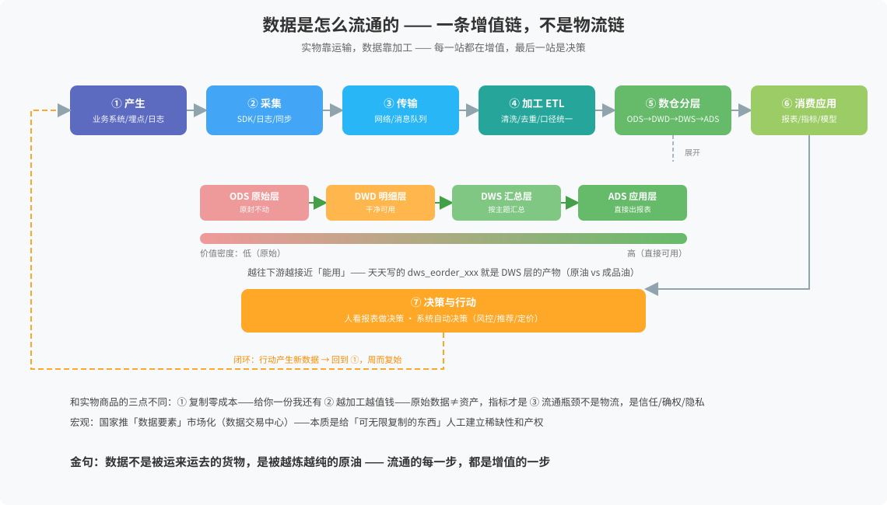

# 数据是怎么流通的

> 一句话：数据流通的本质和实物相反——不是物流链，是增值链。实物越运越少，数据越加工越值钱。
> 来源：2026-08-23 与 Hermes 问答沉淀（数字世界底层常识系列第 3 篇）。

## 全景图

## 三层视角

| 层次 | 讲什么 | 对应 |
|:--|:--|:--|
| 微观（技术） | 比特在网络上怎么运输 | [[互联网是怎么跑起来的]]（包交换） |
| 中观（企业） | 数据在系统间怎么增值 | 本图（增值链） |
| 宏观（社会） | 数据作为生产要素怎么流通 | 数据交易/确权/隐私 |

## 流水线（7 站 + 闭环）

1. **产生**——业务系统（订单/库存）、埋点（用户行为）、日志
2. **采集**——SDK、日志同步、数据库同步
3. **传输**——网络 + 消息队列（缓冲削峰）
4. **加工 ETL**——清洗、去重、**口径统一**（最反人性的活）
5. **数仓分层**——ODS 原始 → DWD 明细 → DWS 汇总 → ADS 应用
6. **消费应用**——报表、指标、模型
7. **决策与行动**——人看报表 / 系统自动决策（风控/推荐/定价）
8. **闭环**——行动产生新数据，回到 ①

> 个人锚点：天天写的 `dws_eorder_eorder_d_his_combine` 就是 DWS 层的产物——已站在增值链中后段，再下游一步是 ADS（直接出报表）。

## 数据 vs 实物商品

| 维度 | 实物商品 | 数据 |
|:--|:--|:--|
| 复制 | 给你我就没了 | 给你我还有，复制零成本 |
| 价值 | 越用越旧、运输有损耗 | 越加工越值钱、越积累越有价值 |
| 独占 | 天然稀缺 | 天然不稀缺——要人工造稀缺 |
| 流通瓶颈 | 物流 | 信任、确权、隐私 |

宏观：国家推「数据要素」市场化（数据交易中心）——本质是给「可无限复制的东西」人工建立稀缺性和产权。

## 最后一公里

数据本身不产生价值，**决策才产生价值**。链上所有加工最终都指向第 ⑦ 步——「运营看报表→做决策」永远比「报表本身」值钱。

金句：**数据不是被运来运去的货物，是被越炼越纯的原油——流通的每一步，都是增值的一步。**

## 关联
- [[开源与操作系统谱系]] —— 系列第 1 篇（许可证光谱、系统家族树）
- [[互联网是怎么跑起来的]] —— 系列第 2 篇（分层协议、请求旅程）
- [[企业沉淀/01-数据架构/数据仓库分层说明]] —— 数仓分层设计
- [[知识库首页]]
