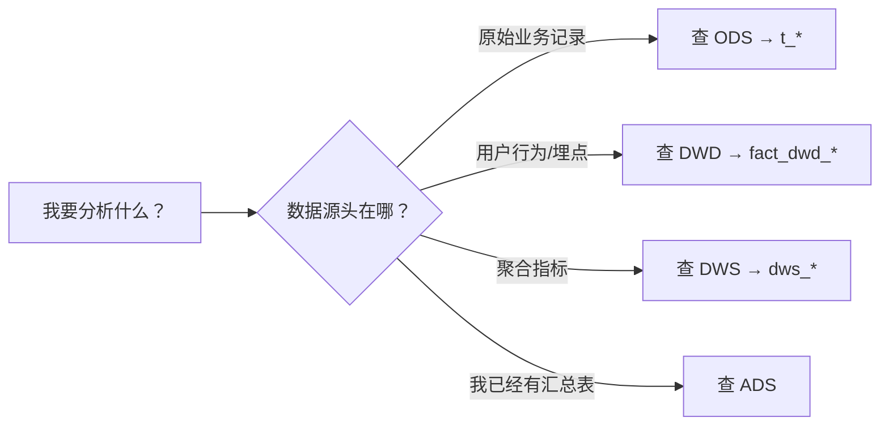

# 数据仓库分层说明

> 本文档面向数据分析、大数据工程同学，说明瑞幸即享咖啡数仓的分层逻辑和使用规范。

---

## 分层总览

```
业务源系统（MySQL/接口）
     ↓
┌─────────────┐
│    ODS      │ ← 源表直拉，天原始数据
└──────┬──────┘
       ↓ 清洗、标准化、去噪
┌─────────────┐
│    DWD      │ ← 明细事件，统一编码
└──────┬──────┘
       ↓ 轻度聚合、宽表化
┌─────────────┐
│    DWS      │ ← 每日快照，主题事实
└──────┬──────┘
       ↓ 业务专用汇总
┌─────────────┐
│    ADS      │ ← 报表/看板专用
└─────────────┘
```

---

## 各层详解

### ODS — 操作数据层

| 属性 | 说明 |
|:----|:-----|
| **来源** | 业务系统 MySQL / API 接口直拉 |
| **加工程度** | 几乎不经清洗，与源表一一对应 |
| **表名特征** | 以 `t_` 开头（如 `t_third_member`, `t_wecom_external_user`） |
| **数据粒度** | 与业务源表一致 |
| **常见场景** | 查原始记录、需要完整源字段的分析 |

**使用注意**：
- 数据质量依赖上游，可能有脏数据（空值、重复等）
- 通常保留所有字段，接口字段变更只需同步 DDL
- join 时注意业务主键是否唯一

### DWD — 明细数据层

| 属性 | 说明 |
|:----|:-----|
| **来源** | ODS 层清洗、标准化 |
| **加工程度** | 去重、格式统一、JSON 解析、标准化事件编码 |
| **表名特征** | 以 `fact_dwd_` 开头（如 `fact_dwd_log_c_luckinpop_detail_d_inc`） |
| **数据粒度** | 单条事件/行为 |
| **常见场景** | 埋点分析、漏斗、留存、用户行为路径 |

**使用注意**：
- 事件编码（`event_code`）可作为分析入口
- 扩展字段 `prop_data` 是 JSON，按需解析
- 同一份埋点数据分两张表（luckinpop=电商交易链路, start_retention=启动留存），因为归属不同业务域

### DWS — 汇总数据层

| 属性 | 说明 |
|:----|:-----|
| **来源** | DWD + ODS 轻度聚合 |
| **加工程度** | 按日分区、宽表化、整单维度的汇总 |
| **表名特征** | 以 `dws_` 开头（如 `dws_eorder_eorder_d_his_combine`） |
| **数据粒度** | 每笔订单 |
| **常见场景** | 客单价、复购、销售额分析 |

**使用注意**：
- **全量快照**：每天一张完整的快照，不是增量表——查询时**必须指定 `dt` 分区**
- 金额口径需要确认：`eorder_income` 是订单收入，`total_ecmdty_payable_money` 是商品应付，两者含义不同

### DIM — 维度数据层

**当前暂无**，后续如有统一的门店/商品/活动维度表会归入此层。

### ADS — 应用数据层

**当前暂无**，后续如有针对特定报表、看板或算法的专用汇总表会归入此层。

---

## 使用规范

### 1️⃣ 查数据前先确认层



### 2️⃣ 选择正确的表

| 分析场景 | 推荐层 | 原因 |
|:--------|:------|:----|
| 某渠道加好友人数 | ODS `t_wecom_external_user_history` | 需要原始事件流水，没别的地方有 |
| 用户行为漏斗 | DWD `fact_dwd_log_c_*` | 埋点数据最全，标准化事件 |
| 月度客单价 | DWS `dws_eorder_eorder_d_his_combine` | 已有聚合好的订单维度，不用自己拼 |
| 活动的中奖概率 | ODS `t_rtd_cap_activity_prize` + 参与流水 | 奖品配置只有 ODS 有，DWS 不存配置信息 |

### 3️⃣ 优先用更高层

**能用 DWS 就别用 DWD，能用 DWD 就别用 ODS**。高层的表已经做过清洗和聚合，查起来更快、更准。

但是——如果高层表没有你需要的字段，或者口径不满足，回到底层自己聚合是完全合理的选择。

---

## 给新同学的建议

如果你是第一次接触这个数仓：

1. **先看 [[数据字典索引]]** — 了解有哪些表、在哪一层、属于哪个业务域
2. **找到熟悉的业务域**（电商/企微/公域/一物一码）→ 看该域下的表
3. **不懂的口径去对应表文档看注意点** — 每张表都写了常见陷阱
4. **有新增的表** → 发 DDL 给 Hermes，更新数据字典

---

> 关联：[[数据字典索引]] · [[SQL经验库]] · [[运营数据分析方法论]]

## Change Log

| 日期 | 变更 |
|:----|:----|
| 2026-07-24 | 初版，定义 ODS/DWD/DWS/DIM/ADS 五层 |
