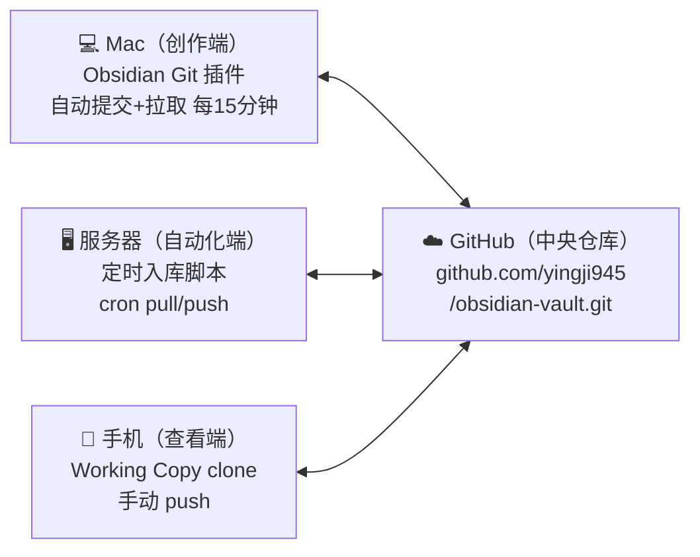

# Obsidian 多端同步方案

> Mac + GitHub + 服务器 + 手机 四端知识库同步

## 当前已配好的

| 端 | 同步方式 | 状态 | 最后配置时间 |
|:--|:--------|:----|:-----------|
| 💻 **Mac 本地** | Obsidian Git 插件自动提交/拉取 | ✅ 已使用中 | 2026-07-28 |
| 🖥️ **服务器** | cron 每小时自动 pull + 入库后自动 push | ✅ 已稳定运行 | 2026-07-28 |
| ☁️ **GitHub 远程** | `github.com/yingji945/obsidian-vault.git`（私有） | ✅ 中央仓库 | 2026-07-28 |
| 📱 **手机（iOS）** | Working Copy 手动 clone → Obsidian 打开 | ✅ 已配置 | 2026-07-29 |

## 架构



## Mac 设置（已完成）

### Obsidian Git 插件配置

1. 社区插件市场搜索 **Obsidian Git** 安装
2. 启用后设置：
   - 自动提交间隔：15 分钟
   - 自动拉取间隔：15 分钟
   - 拉取前先提交：✅ 开启
   - 提交说明：`Auto sync {date}`
3. 日常操作：完全自动，无需手动操作

### 手动操作

如需立即同步，在 Obsidian 内按 `Cmd + P`：

| 操作 | 命令 |
|:----|:----|
| **拉取最新** | `Obsidian Git: Pull` |
| **推送** | `Obsidian Git: Push` |
| **查看状态** | `Obsidian Git: Check status` |

## 服务器设置（已完成）

### GitHub 远程仓库

```bash
# origin 已指向
git remote add origin https://github.com/yingji945/obsidian-vault.git
```

### 自动 pull cron（每小时）

```bash
hermes cron create "0 * * * *" \
  --name "vault-git-pull" \
  --prompt "执行 cd /opt/data/obsidian-vault && git pull --rebase" \
  --deliver local
```

### 知识库入库后自动 push（每晚 23:15）

- 自动拉取 Jacob 沉淀通知 → 写 vault → auto push
- 若 push 失败（GitHub 网络超时），跳过不阻塞，后续 cron 自动补推

## 手机端（iOS）设置

### 首次配置

1. **App Store** → 搜索安装 **Obsidian**（免费）
2. **App Store** → 搜索安装 **Working Copy**（免费版够用）
3. **Working Copy**：
   - 登录 GitHub 账号
   - 点击右上角 `+` → Clone Repository
   - 输入：`https://github.com/yingji945/obsidian-vault.git`
   - 克隆完成后，点仓库名 → 点 **"Open in Obsidian"**
4. **Obsidian**：
   - 自动打开 vault，开始浏览笔记
   - 手机上编辑笔记 → 保存后回到 Working Copy
   - Working Copy → commit → push

### 日常同步流程（手机）

```
Obsidian 编辑完 → 保存
  → 切到 Working Copy
  → 点仓库 → 点"Push"
  → 完成 ✅
```

> ⚠️ 手机端没有自动 git 插件，每次编辑后需要手动推一次

## 冲突处理原则

| 场景 | 处理方式 |
|:----|:--------|
| **同一个文件两边都改了** | Mac 版本优先，Obsidian Git 会显示冲突标记手动解决 |
| **Mac 上新建的笔记服务器没有** | 自动合并，无需操作 |
| **服务器新建的笔记 Mac 没有** | `git pull` 后自动出现 |
| **手机改完推了，Mac 有冲突** | `git pull` 后手动解决冲突 |

> **Mac 是权威端：** 如果同一个文件两边都改了，以 Mac 上的版本为准

## 首次使用流程（换电脑/重装）

### 新电脑

1. 装 Obsidian → 社区插件装 Obsidian Git
2. 克隆仓库：
   ```
   Cmd + P → "Obsidian Git: Clone an existing remote repo"
   输入：https://github.com/yingji945/obsidian-vault.git
   ```
3. 配好自动提交拉取间隔
4. 打开 vault，全部笔记自动出现

### 新手机

1. 装 Obsidian + Working Copy
2. Working Copy 里 clone 仓库
3. Obsidian 里打开

## 关联 vault 文件

- [[技能库/Hermes多模型路由配置方案]]
- [[技能库/SQL经验库]]
- [[技能库/用户分层SQL模板]]
- [[企业沉淀/数据仓库分层说明]]
- [[企业沉淀/数据字典维护规范]]

---

> 📌 2026-07-29 初版
