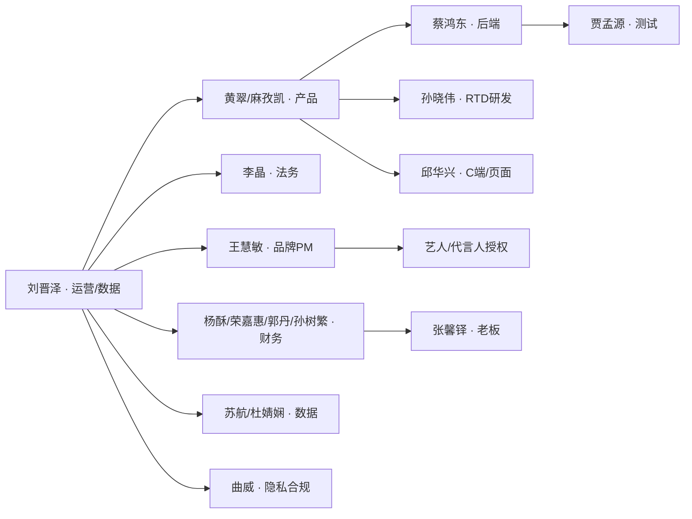
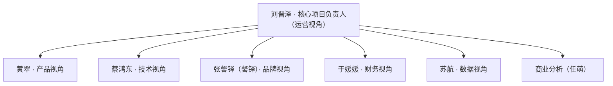

# 02-角色责任矩阵

> 谁负责什么、谁能拍板、出事找谁。依据列说明信息来源；无依据的一律标注「推断」。

---

## 一、核心角色（有明确职责证据）

| 角色 | 姓名 | 负责领域 | 项目中的关键动作 | 拍板权 | 依据 |
|:--|:--|:--|:--|:--|:--|
| **运营负责人** | 刘晋泽（你） | 整体策略 · 数据决策 · 跨部门协调 | 统计口径与看板 P0/P1/P2、AB 实验对接、财务/法务/品牌三线协调、打款监控与决策点拍板 | ✅ 运营与数据侧 | 全程 |
| **产品负责人** | 黄翠 | 产品决策层 | 内测评审、二期原型、跨部门评审把关 | ✅ 产品方向 | 7/09、7/14、7/15 参会 |
| **产品经理** | 麻孜凯 | 需求与方案 · 后台配置 | V26.4.1/V26.6.2 PRD、抽奖系统与奖品配置、**7/31 误改「对企业发券的企业」配置待修复** | 产品方案（不拍板预算/合规） | 全景笔记、08-01 沉淀 |
| **后端研发** | 蔡鸿东 | 后端实现 · 技术方案 | 后端技术方案（103KB）、膨胀表二期 1 对多结构、压测排期 | 技术实现 | 7/16、7/25 纪要 |
| **RTD 侧研发** | 孙晓伟 | RTD 系统与上线窗口 | **8/3 19:29 与王慧敏二次确认硬上线**；7/30 提出排期冲突（「整体排期我们这辈子排不上」） | ✅ 技术上线窗口 | 7/14、08-03 |
| **研发** | 邱华兴 | C 端页面 · 弹窗 · 代码合并 | 首页弹窗规则、中奖信息配置层、8/4 代码合并 | — | 7/08、7/10、08-04 |
| **法务** | 李晶 | 合规审查 | 税务/规则/去重/最高奖项**不得限制使用范围**；上线前 4 天复核期 | 合规审核（事实上的放行权，推断） | 6/18、6/23、7/17 |
| **品牌 PM** | 王慧敏 | 品牌活动 · 项目推进 | **艺人授权流程（8/3 deadline）**、RTD 大群公告、8/4 09:00 同步会 | 品牌侧 | 7/02、7/17、08-03 |
| **数据** | 苏航 | 数据与看板 | **8-17 数据看板 deadline** | — | 7/16、08-05 |
| **测试** | 贾孟源 | 内测 | 内测配置、8/4 验生产环境、365 库券问题 | — | 7/14、7/15、08-01 |

---

## 二、扩展协作者（按领域分组）

| 领域 | 成员 | 已知动作 | 依据 |
|:--|:--|:--|:--|
| 💰 财务/结算 | 杨酥 | 费用分摊逻辑、应允 9 月初上线（引发排期冲突） | 7/10、07-30 |
| | 荣嘉惠 | 打款对接（与郭丹 P2P，全程 0 消息） | 7/03、08-04 |
| | 郭丹 | 财务到账验证（8-5 07:00 前 P2P 验证） | 08-05 |
| | 孙树繁 | 核算对账口径对齐（7/31 15:00 视频会） | 7/21、07-31 |
| | 林惠婷 | 活动筹备与打款协调 | 7/07 |
| 📊 数据 | 杜婧娴 | 红包膨胀券数据需求（底层表拼接） | 7/08、7/13 |
| ⚖️ 合规/隐私 | 曲威 | 去重补充信息合规性 | 7/22 |
| 🎨 品牌/市场 | 黄云健 | 活动规则研讨（含法务） | 7/17 |
| | 杨洲中 | 红微投放（即享首次红微渠道，8/4 23:59 上线） | 08-04 |
| | 翟乐天 | 代言人咖啡液营销项目培训 | 07-27 |
| 🧪 实验 | 谢婉君 / 谢茹 | AB 实验平台评估 | 全景笔记待办 |
| 🛠️ 研发/测试 | 谢宝塔、未来、杨岩 | 内测与功能优化（V26.7.1） | 7/14、7/15、6/25 |
| 📋 其他协作者 | 林心怡、刘亚萌、李晗、焦佳溪 | 各专项会参会 | 7/10 |
| 🏢 管理层 | 张馨铎（老板） | 周末自救 3 步法第一站（财务卡壳时） | 08-03 |

> ⚠️ 本组「负责领域」由会议主题 + 上下文**推断**，非本人确认；Jacob 的人物档案（企业沉淀层）到位后可校准。

---

## 三、决策链：谁定什么

| 决策类型 | 拍板人 | 例证 |
|:--|:--|:--|
| 产品方案与优先级 | 黄翠 / 麻孜凯 | 7/14 内测评审（P0/P1 排期） |
| 规则表述与合规 | 李晶 | 6/18 账号绑定与规则全量展示、7/17 价值标注方案 |
| 技术实现与上线窗口 | 蔡鸿东 / 孙晓伟 | 8/3 硬上线二次确认 |
| 品牌与艺人授权 | 王慧敏 | 8/3 艺人授权 deadline |
| 运营策略 · 数据口径 · 费用归集 | **刘晋泽（你）** | 7/16 统计对齐会、7/22 财务 pivot、8/3 决策点 A/B/C |
| 财务打款与费用分摊 | 杨酥 / 孙树繁 → 老板层级（张馨铎） | 7/30~8/3 财务僵局需上级推动 |
| 预算调整（956万→350万） | 老板层级 + 你 | 6/04、6/11 |

---

## 四、跨团队协作路径

**协作机制（实战验证过的）**：

| 机制 | 说明 | 来源 |
|:--|:--|:--|
| 4 节点制 | 每日 11:00 / 13:00 / 15:00 / 17:00 财务打款跟催 | 7/27 沉淀 |
| 一天多场会 | 7/22 一天六场、7/10 一天四场——冲刺期用会议密度换对齐速度 | 纪要 |
| 独立项目群 | 6/22 迁移飞书群、7/07 建财务沟通群、RTD 项目推进大群（oc_ca6b8a…） | 时间线总览 |
| P2P 兜底 | 群消息被拦（230002）时改用 P2P 推送 | 08-04 沉淀 |

---

## 五、重来版治理结构（用户口述 · 2026-10-07）

> ⚠️ 本节是**"重来一次应该怎么设"**，不是实际配置（实际见上表：项目由**运营单点**横向推动财务/技术/运营/商业分析）。

| 视角 | 子负责人 | 该视角要对什么负最终责任 |
|:--|:--|:--|
| **核心项目负责人** | 刘晋泽 | 集成 · 决策 · 对外；**不逐条推销** |
| 产品 | 黄翠 | 产品功能能否落地 + **能否入账**（耦合最重的环节） |
| 技术 | 蔡鸿东 | 技术实现 · 接口 · 排期可行性（约束方，不拍方向） |
| 品牌 | 张馨铎（馨铎） | 品牌调性 · 艺人物料 · 宣传口径 |
| 财务 | 于媛媛 | **入账口径 · 税负 · 结算 · 打款** |
| 数据 | 苏航 | 数据链路 · 看板 · 交付层级 · 口径 |
| 商业分析 | 任萌 | **成本-收益**（本项目 956万→350万 的推动方） |

**选人标准（用户原话）**："因为这里的**耦合其实还比较严重**，产品上的功能最后能不能入账，也会进入财务系统中，所以这部分应该是**有相对有些技术逻辑、还有考量的人在**，衔接的会更顺利一些。品牌、以及商业分析也是，都会涉及到这种问题。"
→ 即：子负责人必须**懂本职能 + 懂交叉约束**，不能只选"纯职能专家"。

**阶段门禁（用户原话）**：

| 阶段 | 必到方 | 门禁问题 |
|:--|:--|:--|
| 立项 | 财务 / 品牌 / 商业分析 | 会不会发生**费用**？口径与归属是谁？ |
| 预算评审 | 财务 | 怎么**入账**（记账口径/税负/结算周期）？ |
| 方案定稿 | 数据 + 财务 | 数据能不能**进入财务系统**？ |

**治理顺序（用户原话）**："**组织要先意识到复杂性，配合方多，再做授权，定核心负责人**。"
**主导方（用户原话）**："项目起点最好是**运营 + 业务主导**，而不是技术和产品，有点本末倒置，**他们本身对收益不负责**。"

> 方法论展开见 [[一物一码/06-复盘升华/01-方法论沉淀\|方法论沉淀]] #10 / #11 / #27 / #29。

---

## 六、待补与已知风险

- [ ] Jacob 人物档案（企业沉淀层）→ 校准第二组职责
- [ ] 7/31 麻孜凯配置误改的生产环境修复确认结果
- [ ] 财务群零消息 → 8/4 复盘提出的「**24h+ 未兑升级机制**」是否已固化
- 关联卡点：[[一物一码/02-业务视角/04-业务卡点库|业务卡点库]] #6 跨账号兑奖、#7 商户号主体

---

> 关联：[[一物一码索引]] · [[01-完整时间线]] · [[03-业务流程图]] · [[一物一码项目全景笔记]]
