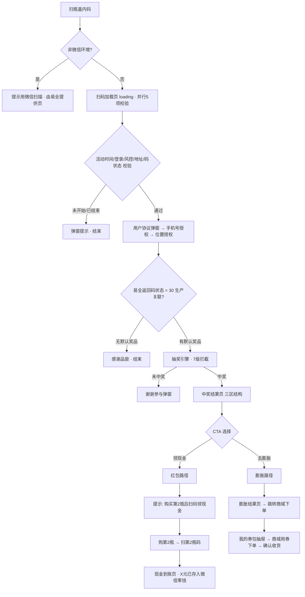
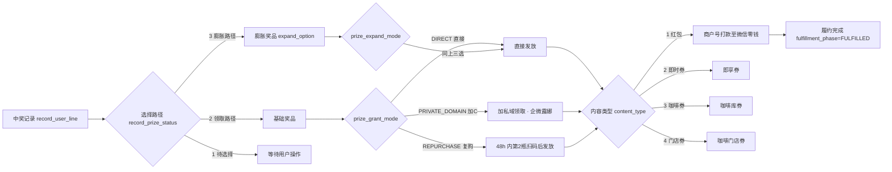
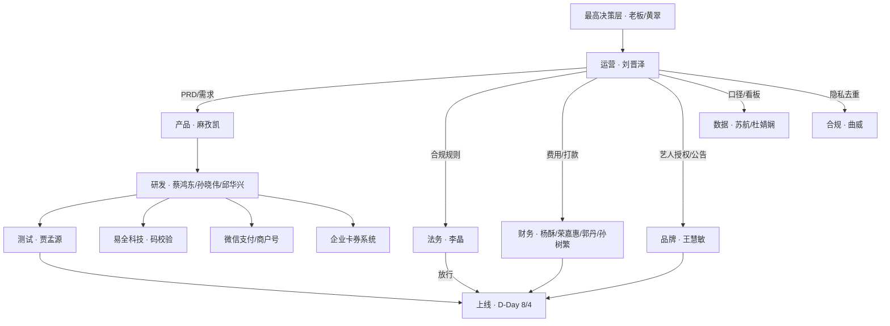

# 03-业务流程图

> 四张图看懂一物一码：① 用户端主流程 ② 扫码校验与抽奖链 ③ 领奖与履约 ④ 跨团队协作。
> 配置侧操作细节见 [[09-运营后台配置流程]]；页面级细节见 [[08-C端用户旅程]]。

---

## 一、用户端主流程（扫码 → 中奖 → 领奖 → 核销）



---

## 二、扫码校验与抽奖链（7 级拦截）

```
环境检测 → 活动时间 → 登录状态 → 微信零钱 → 设备风控 → 黑名单 → 码有效性(易全)
                                    ↓
                          ┌─────────────────────┐
                          │  1 位置授权校验      │ 不中奖
                          │  2 活动总库存校验    │ 不中奖
                          │  3 时段库存校验      │ 不中奖
                          │  4 个人中奖上限      │ 不中奖
                          │  5 新用户判定        │ 新用户直接中奖
                          │  6 城市库存校验      │ 不中奖
                          │  7 概率计算          │ 命中中奖 / 未命中不中奖
                          └─────────────────────┘
   概率公式：(城市奖品总量 - 已中奖数) / (城市产品总量 - 已扫码数 / 预估扫码率)
   命中位点：参与流水表 layer_break_code 记录在哪一层被拦截（空=未拦截）
```

> 库存三层：活动总库存 · 时段库存（1/4/8 小时桶）· 城市库存；个人维度：中奖次数上限 + 每日抽奖频次 + 参与次数。
> 兜底：`default_prize=1` 的奖品行（全活动至多一行）承接未中非默认奖的用户。

---

## 三、领奖与履约流程（三条路径）



**履约状态机（关键枚举）**

| 字段 | 取值 | 含义 |
|:--|:--|:--|
| `record_prize_status` | 1 / 2 / 3 / 4 | 待选择 / 领取路径 / 膨胀路径 / 已作废 |
| `fulfillment_phase` | PENDING / EXPAND / PENDING_COUPON / PENDING_REDPACK / WITHDRAW / FULFILLED / VOID | 履约阶段 |
| `instance_status`（红包实例） | 20 / 30 / 40 / 50 | 待复购 / 待使用 / 处理中 / 已打款成功 |
| `prize_grant_mode` | DIRECT / PRIVATE_DOMAIN / REPURCHASE | 直接 / 加C私域 / 复购 |

> 中奖 ≠ 履约成功：统计发奖必须看 `fulfillment_phase='FULFILLED'`（数据口径见 [[一物一码/04-数据视角/01-数据链路全景|数据链路全景]]）。

---

## 四、跨团队协作流程



### 信息流转路径

| 来源 | → 去向 | 内容 | 传输方式 | 频率 |
|:--|:--|:--|:--|:--|
| 运营（你） | 产品/研发 | 需求、口径、决策点 | 飞书会议 + P2P | 近乎每日（冲刺期一天 4~6 场） |
| 财务 | 运营 | 打款进度、费用口径 | 财务沟通群 | 4 节点制（11/13/15/17 点） |
| 法务 | 运营/产品 | 合规结论、规则修改 | 会议 + P2P | 关键节点（上线前 4 天复核） |
| 品牌 | 运营/大群 | 艺人授权、上线公告 | RTD 项目推进大群 + P2P | 里程碑 |
| 研发 | 运营/测试 | 排期、问题修复 | 项目群 + 任务系统 | 每日 |
| 数据 | 运营 | 口径确认、看板交付 | 会议（如 7/16 统计对齐会） | 里程碑 |

### 关键接口人

| 接口/事项 | 对接方 | 接口人 | 依据 |
|:--|:--|:--|:--|
| 产品需求与配置 | 产品 | 麻孜凯 | 8/01 配置修复 |
| 后端实现 | 后端 | 蔡鸿东 | 7/16、02 技术方案 |
| 上线窗口 | RTD 研发 | 孙晓伟 | 8/03 二次确认 |
| 合规放行 | 法务 | 李晶 | 7/17 规则研讨会 |
| 财务打款 | 财务 | 荣嘉惠 / 郭丹 | 08-04、08-05 |
| 核算对账 | 财务 | 孙树繁 | 07-31 |
| 艺人授权/品牌 | 品牌 | 王慧敏 | 08-01、08-03 |
| 看板与口径 | 数据 | 苏航 / 杜婧娴 | 08-05、7/13 |
| 隐私去重 | 合规 | 曲威 | 7/22 |
| 码校验（外部） | 易全科技 | 逸群（接口文档） | [[2026-05-08-易全同步瓶内码信息给瑞幸接口]] |

---

## 五、数据回流（业务→看板）

```
扫码/中奖/发放事件 → 业务库 lucky_epromotion（participate_log / record_user_line / activity_prize）
        │
        ├─ 埋点：ods_log.t_hmonitor_track_event（event_code=lottery_main_page_bw 等）
        └─ 数仓：DIM/ADS（dim_inst_rtd_cap_activity_d_his / ads_inst_cap_activity_win_grant_d_inc）
                        ↓
                SQL 宽表 → 活动效果表 + 奖励履约表 → 看板（8-17 deadline）
```

> 字段级映射见 [[一物一码/04-数据视角/02-字段映射清单|字段映射清单]]；链路原则见 [[一物一码/04-数据视角/01-数据链路全景|数据链路全景]]。

---

> 关联：[[一物一码索引]] · [[08-C端用户旅程]] · [[09-运营后台配置流程]] · [[02-角色责任矩阵]] · [[一物一码/03-技术视角/03-系统交互矩阵|系统交互矩阵]]
