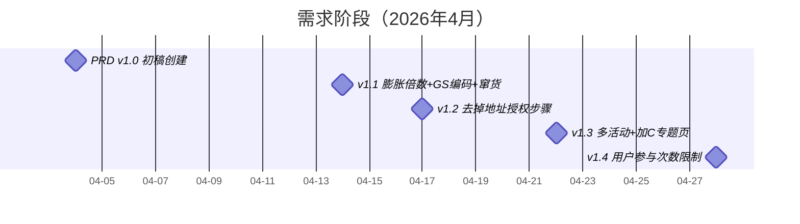
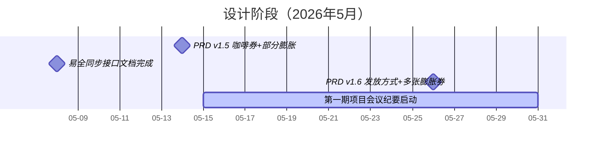
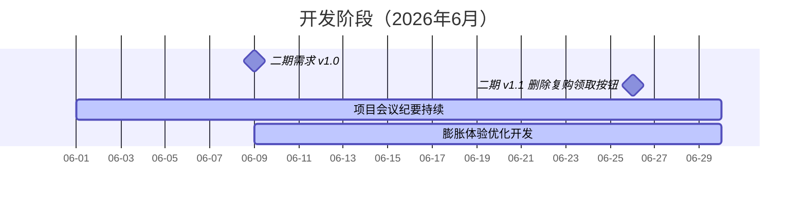
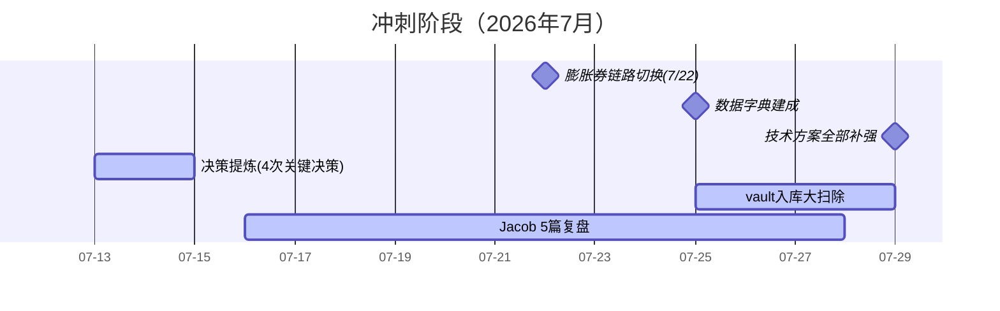
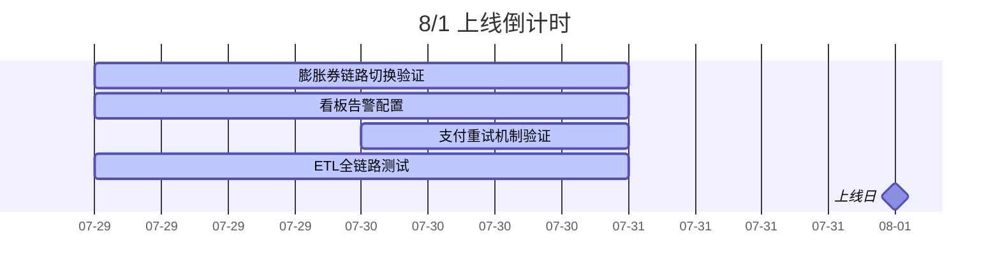

# 一物一码项目全生命周期地图

> 从 2026 年 4 月到 8 月上线的完整经历，串联需求→设计→开发→上线冲刺四个阶段

---

## 第一阶段：需求定义（4月）



| 时间 | 事件 | 产出 | 关键人 |
|:---|:----|:----|:-----|
| 04-04 | PRD 初稿 | 复购红包活动需求文档 v1.0 | 麻孜凯 |
| 04-09 | 后端技术方案初版 | V26.4.1 技术方案 v0.1.0-alpha | 蔡鸿东 |
| 04-14 | PRD v1.1 | 膨胀倍数放奖品行、GS编码定商品范围、窜货展示、黑名单统一风控 | 麻孜凯 |
| 04-17 | **PRD v1.2** | **去掉地址授权步骤**（体验优化决策） | 麻孜凯 |
| 04-22 | PRD v1.3 | 增加多活动判断、加C专题页跳转 | 麻孜凯 |
| 04-28 | PRD v1.4 | 增加单用户参与次数和每日次数限制（风控兜底） | 麻孜凯 |

> 📌 **关键决策：** 去掉地址授权（v1.2）——早期版本要求用户必须授权位置才能参与，v1.2 改为可选，减少用户流失
>
> **vault 对应：** 原始纪要 → `2026-04-04-复购红包活动需求文档V26.4.1.md`

---

## 第二阶段：设计细化（5月）



| 时间 | 事件 | 产出 | 关键人 |
|:---|:----|:----|:-----|
| 05-08 | 易全接口规范完成 | 易全同步瓶内码信息接口（POST /products/callback） | 蔡鸿东 |
| 05-14 | **PRD v1.5（大版本）** | 咖啡优惠券+库券、部分膨胀、不同活动同商品编码、瓶身码与盖内码联动、易全接口确认 | 麻孜凯 |
| 05-26 | PRD v1.6 | 奖品发放方式、膨胀多张券、加C获得/直接获得 | 麻孜凯 |
| 05-15~31 | 一期会议纪要（Phase1） | 原始纪要 9 篇 | Jacob |

### 涉及系统设计

```
易全科技（五码系统）
  │  POST /products/callback
  │  status: 10→20→30→40
  ▼
瑞幸电商系统
  ├── epromotion（促销系统）— 活动配置、抽奖逻辑、6级拦截
  ├── 会员系统 — 三方会员同步、站内绑定
  └── 支付系统 — 微信打款（王鑫对接）
```

> 📌 **关键决策：** 易全接口 5 月中旬确认——码同步方案定型
>
> **vault 对应：** 原始纪要 → `2026-05-08-易全同步瓶内码信息给瑞幸接口.md`

---

## 第三阶段：开发迭代（6月）



| 时间 | 事件 | 产出 | 关键人 |
|:---|:----|:----|:-----|
| 06-09 | **瓶内营销二期 PRD v1.0** | 膨胀体验优化：效果大图、多奖品Tab、概率配置、奖品重发 | 麻孜凯 |
| 06-26 | 二期 v1.1 | **删除复购领取按钮**（流程简化） | 麻孜凯 |
| 06 月 | 二期开发 | 膨胀配置后台开发、奖品重发功能开发 | 蔡鸿东 |
| 06 月 | 项目会议纪要（Phase2-3） | 原始纪要 13 篇 | Jacob |

> 📌 **关键决策：** 删除复购领取按钮（v1.1）——标志着复购流程从"用户手动确认"简化为"扫码即打款"，减少用户操作步骤
>
> **vault 对应：** 原始纪要 → `2026-06-09-瓶内营销二期V26.6.2需求文档.md`

---

## 第四阶段：上线冲刺（7月）



| 时间 | 事件 | 产出 | 关键人 |
|:---|:----|:----|:-----|
| 07-13 | 核心业务事项推进 | 决策提炼：即享业务事项、红包膨胀券数据需求 | 用户+团队 |
| 07-14 | 内测评审 | 瓶内营销活动内测评审 | 团队 |
| 07-15 | **商品码 30 状态确认** | 码状态=30（已出货）才算有效可参与活动 | 用户+蔡鸿东 |
| 07-22 | **⚠️ 膨胀券链路切换** | 原定 C 端发券接口不可行，转企业卡券系统（**技术方案重大调整**） | 蔡鸿东 |
| 07-25~28 | vault 入库 | 数据字典13张表、三视角补强、Jacob复盘5篇 | Hermes |
| 07-26 | 上线盯防 | 8/1 上线风险监控与盯防清单 | 用户 |
| **07-29** | **文档全面补强** | **后端方案+PRD+二期+易全接口+9张图→15文件更新** | Hermes |

### 4 次关键决策

```
① 商品码30状态（07-15）
   码状态=30才算有效，码状态对不上活动的产品不参与
   
② 膨胀券链路切换（07-22）
   C端发券接口 → 企业卡券系统（重大技术转向）

③ 数据字典13表建成（07-25）
   ODS/DWD/DWS/ADS 全链路覆盖

④ 上线风险监控（07-26）
   扫码量、中奖率、支付失败率 P0 告警
```

### 涉及 vault 全量文档

| 目录 | 文件数 | 说明 |
|:----|:-----|:----|
| 01-原始纪要 | 39 篇 | 6 份大文档 + 33 篇会议纪要 |
| 02-业务视角 | 9 篇 | 时间线→用户旅程→运营配置+卡点+复盘 |
| 03-技术视角 | 6 篇 | 架构→状态机→交互→卡点→容错→领域模型 |
| 04-数据视角 | 5 篇 | 链路→字段→断链→卡点→看板检查 |
| 05-决策提炼 | 4 篇 | 4 次关键决策记录 |
| 06-复盘升华 | 9 篇 | 方法论+认知+交接手册+Jacob 5篇+时间线 |
| 07-项目全景 | 4 篇 | 索引+纪要继续+全景笔记+盯防清单 |

> 共计 **74 篇**（已全部填充）

---

## 上线前检查清单



> 📌 详细待办见 `07-项目全景/2026-07-26-一物一码8-1上线盯防风险监控.md`

---

## 参与角色

| 角色 | 人 | 职责 |
|:----|:--|:----|
| 💼 **产品经理** | 麻孜凯 | PRD 编写、需求演进（v1.0→v1.6→二期） |
| 🔧 **后端开发** | 蔡鸿东 | 技术方案、系统设计、易全对接 |
| 📝 **项目助理** | Jacob | 会议纪要、每日复盘、5 篇阶段复盘 |
| 👤 **运营负责人** | 刘晋泽 | 决策拍板、数据看板、风控策略 |
| 💰 **支付系统** | 王鑫 | 微信打款对接、商家转账到零钱 |
| 🔗 **三方供应商** | 易全科技 | 五码系统（生成→打印→关联→防窜货） |
| 🔗 **三方供应商** | 企业卡券系统 | 膨胀券发放与核销（7/22确认接入） |

---

> 关联：[[一物一码索引]] · [[一物一码纪要索引]] · [[一物一码项目全景笔记]]
