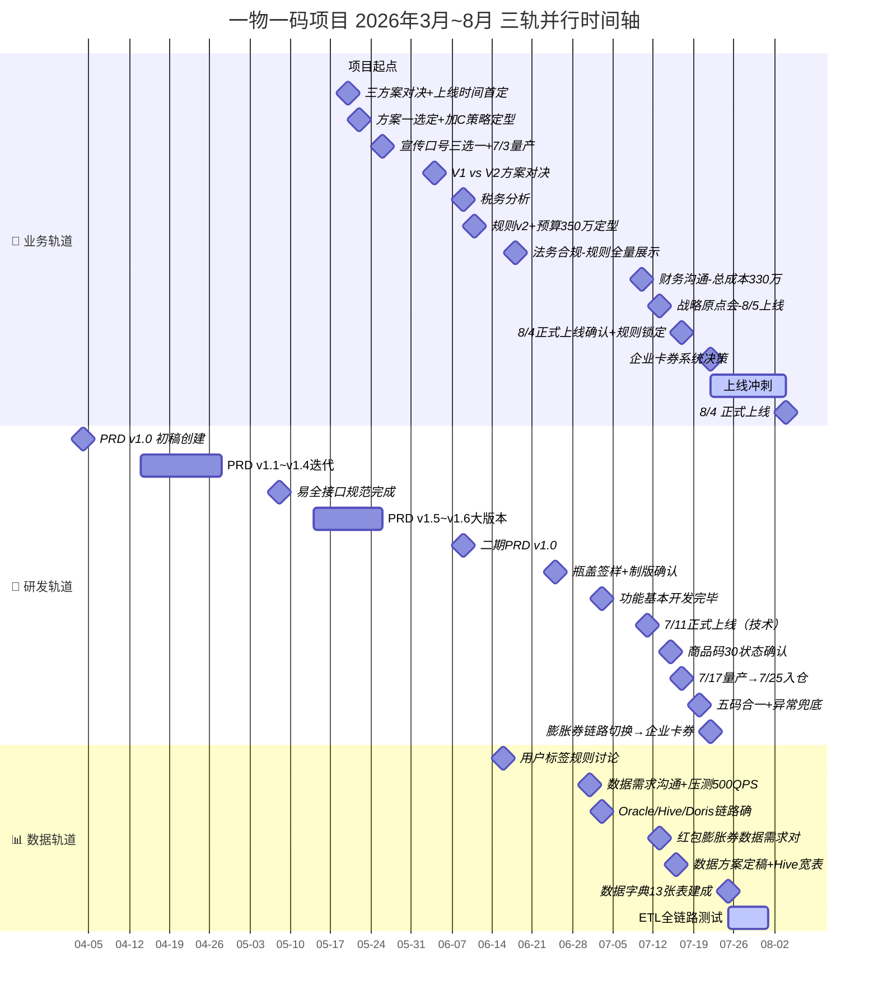
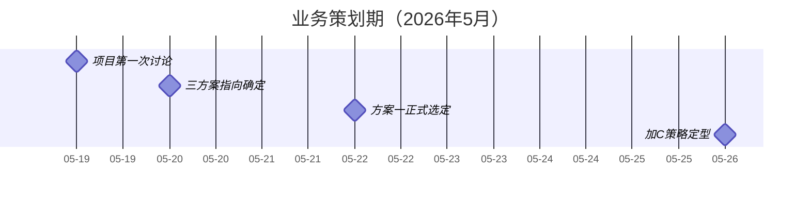
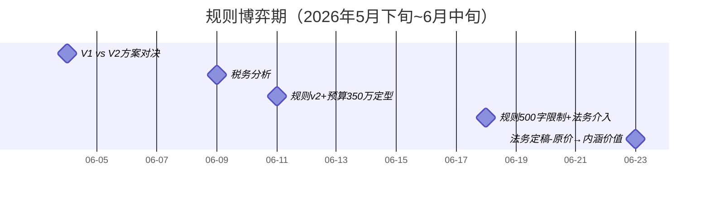
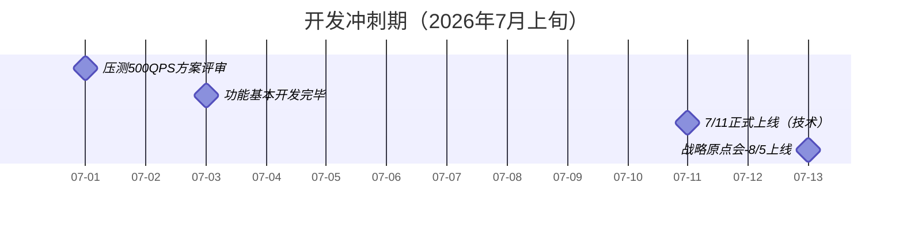
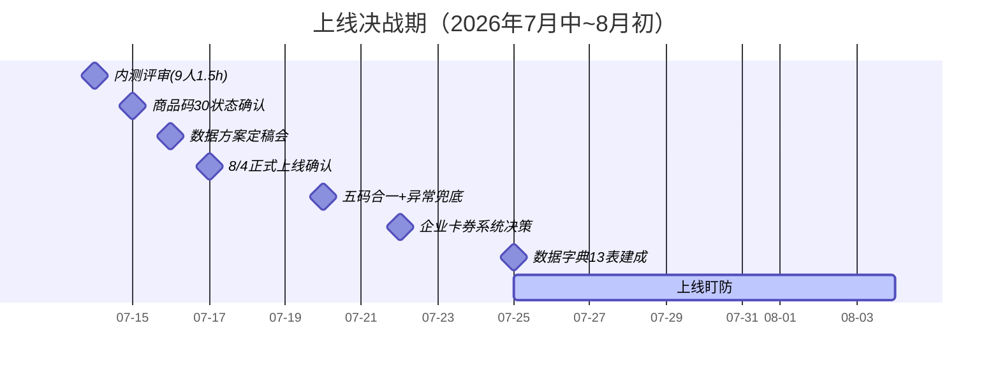

# 一物一码项目全生命周期地图（多轨并行版）

> **版本说明：** 本文档从三轨并行视角重构项目全貌。每条轨道代表一个独立工作流，交叉节点 ⚡ 标注了关键决策如何跨轨道产生影响。
>
> 适用对象：项目全权负责人 + 中高层 —— 一眼看清全局：谁在干什么、什么时候、谁在等谁。

---

## 总图：三轨并行时间轴



---

## 第一阶段：业务策划期（5月17日~5月26日）

> 从零到一：项目起点、三方案对决、加C策略定型、宣传口号与预算初判



| ⏰ 时间 | 🏢 业务轨道 | 🔧 研发轨道 | 📊 数据轨道 |
|:-------|:-----------|:-----------|:-----------|
| **05-19** 🥇 | **项目第一次讨论** — 方案一（小额可膨胀轻量化）vs 方案二（裂变+概率化），**方案一胜出**；红包结构30%现金+70%券；原定6/12系统上线→6月底启动 | PRD v1.0 已创建（4/4），v1.1→v1.4 迭代中 | — |
| **05-20** 🎯 | **三方案指向确定**：①导向加C ②导向复购不一定加C ③促进第一批销售；**上线时间首次确定 7/20**；加密方案二自动化加密+4万+10天；扫码率预估20-30% | — | — |
| **05-22** 🏆 | **方案一正式选定**：送门店咖啡券+加C为核心；红包策略：极享兜底券60%→0.5元红包25%；加C策略：1元/4元加C→预计沉淀**60万企微好友**；包装「扫码赢门店红包」；时间→下周三与杨飞沟通→7月底上线 | PRD v1.5 筹备中 | — |
| **05-26** 🎯 | **宣传口号三选一**：①365杯免费送 ②100杯免费送 ③开盖赢门店咖啡；**1元强制加C，0.5元强制加C测试一个月**；8600万瓶约2.3亿，净利率~20%；**7/3量产首次提出**；资源位：首页轮播/弹窗/金刚位/开屏/菜单 | PRD v1.5 大版本（增加咖啡券+库券、膨胀多张券、易全接口确认） | — |

### 📣 品牌轨道（占位）
| ⏰ | 事件 | 状态 |
|:--|:----|:----|
| 05-26 | **宣传口号三选一定稿** | ✅ 已录入 |
| — | **王一博代言人确定时间** | 🟡 `[待补充]` |
| — | **投放策略/渠道分配/预算审批** | 🟡 `[待补充]` |

> 💡 **当前阶段关键判断：** 业务已经领先研发一个月在讨论了。项目起点是5/19，但PRD从4/4就已经开始迭代——**研发其实走在业务前面做需求文档**，说明整体项目的统筹角色缺失（5/20金句：「整个项目缺统筹方，目的不明确」）。

---

## 第二阶段：规则博弈期（5月下旬~6月中旬）

> 业务规则反复博弈 + 税务引爆规则重构 + 法务合规介入 + 研发并行推进



| ⏰ | 🏢 业务轨道 | 🔧 研发轨道 | 📊 数据轨道 |
|:--|:-----------|:-----------|:-----------|
| **06-04** ⚔️ | **V1 vs V2方案对决→V1胜出**：取消99元/9.9元大额红包；**AB测试设计**（A组加C/B组复购二评）；预算956万→870万；奖品：365张券一次性到账，有效期一年；7/3量产确认 | — | AB测试方案初稿 |
| **06-08** 📋 | **活动规则 v1（0608版）**：6级奖品结构（365张→0.5元红包）；加C或复购随机分配 | — | — |
| **⚡06-09** 💰 | **【交叉节点 #01】税务分析**：>5元红包20%个税→**直接驱动取消大额红包**；免费券同征20%个税；即享券15元=销售折扣无税负 | 二期PRD v1.0 发布（膨胀体验优化） | — |
| **06-11** 📊 | **规则v2（0611版）**：中奖率全面调整（三等奖0.002%→0.5%，四等奖14%→20%，五等奖23%→39%，六等奖60%→40%）；新增**6.6元券**档次；**预算350万定型**（1000万→398万→350万）；LTV目标2000万；「最高赢」被律师反对→「有机会赢」 | — | — |
| **06-15** 🏗️ | 一物一码采购确认：**私有化部署**；只传随机码给易全，无合规风险 | 数据链路确认：平码为必要字段 | — |
| **06-16** 🏷️ | **用户标签系统规则定型**：新客=公域+私域无下单记录→反向取；实时走CDP标签 | 系统核心配置：抽奖活动管理、奖品配置、GS编码 | 新老客标签规则：实时+离线标签结合 |
| **06-18** ⚖️ | **【交叉节点 #02】法务合规专项**：~20%用户无微信ID→客服兜底；规则500字限制不够→需全量展示；上线前4天复核 | 内测红包0.1元；膨胀奖品配置（15元券60%/9.9券/0元兑换） | — |
| **⚡06-23** 🎫 | **【交叉节点 #03】排产延迟→上线推迟**：产品20号生产不出→**7/20推迟到7/30**；「原价」→「内涵价值约25元」；「咖啡券」→「饮品券」；先提审再改 | UI/UX定稿会（按钮文案/「恭喜中奖」/微信号绑定维持现状） | — |

⚡ **交叉影响节点 #01：税务分析 + 规则重构**
```
触发时间：06-09 09:35~10:17
触发方：业务（税务团队出报告）
影响方：研发（需改膨胀券奖品逻辑，取消99元/9.9元）
        业务（规则 v2 重新定，0611全面调整中奖率）

因果链：>5元红包20%个税 → 取消99元/9.9元大额红包
        → 前三档无膨胀 → 预算956万→870万→最终350万
        → 中奖率全面调整（0608→0611规则差异）
        → 新增6.6元券中间档次

反事实推演：如果没做税务分析
        → 大额红包上线 → 用户中99元需缴20%→体验差
        → 企业暗中代缴→成本超预算
        → 上线后发现税务问题再改=灾难
```

⚡ **交叉影响节点 #02：法务合规 + 规则展示**
```
触发时间：06-18 16:08~16:48
触发方：法务（李晶）
影响方：业务（规则修改）+ 研发（前端放开500字限制）

关键卡点：规则字数限制500字→实际2318字
决策：法务要求全量展示→放开限制

后续影响：规则展示方式决定了H5前端页面的设计容量
```

⚡ **交叉影响节点 #03：供应链延迟 + 全项目节奏**
```
触发时间：06-23
触发方：生产端（产品20号生产不出）
影响方：全项目（上线日期 7/20→7/30→最终8/4）

因果链：排产跟不上→上线推迟→标注资源更充裕→更多轮法务审核
        同时也导致：品牌物料有更多准备时间

核心教训：活动上线时间受制于产品供应——「不能活动上线了产品还没到」
```

---

## 第三阶段：开发冲刺期（7月上旬）

> 功能开发完成、数据链路打通、财务预算锁死、战略目标对齐



| ⏰ | 🏢 业务轨道 | 🔧 研发轨道 | 📊 数据轨道 |
|:--|:-----------|:-----------|:-----------|
| **07-01** 🏋️ | — | **压测方案评审（45人史上最大规模）**：目标500QPS；先不扩容探上限；关闭目标接口限流 | 数据需求沟通：8600万瓶、王慧敏提供历史最高发运量 |
| **07-02** | **品牌规则已提交法务**；排产从7月**延迟到8月**；打款预留20天；7/26活动上线计划；扫码攻略7/10出图；二期视觉稿修改 | 7/10技术上线；补发一版小程序带二期 | — |
| **07-03** ✅ | — | **功能基本开发完毕**；表已落完；财务对接赵毅；原计划7/10~11上线→7/26活动上线 | **【交叉节点 #04】Oracle/Hive/Doris数据链路确定**；仅需2-3张表关联；OneData/指南针/神策工具链定稿 |
| **07-07** | **中奖方式定稿**：加微信发券✅ / 复购第二瓶扫码✅ / 直接到账❌；复购48h规则；~24万张券；7/11功能上线→7/26业务开展 | **7/11正式上线**；券创建加标识区分一物一码来源；跑通3个case | 测试方案：现金/门店/自有3个case→展示→批量 |
| **07-08** | 中奖率计算：各奖项不能直接加总；**11个奖品**需算真实中奖率；~12张素材图片；复购红包→扫新瓶盖才发放 | — | — |
| **07-09** | RTD周会（12人）：**7/27入电商仓**；二期本周五上线→下周线上验证；内测明天上线→李晶定规则→王慧敏给艺人审核 | 二期上线 | — |
| **⚡07-10** 💰 | **【交叉节点 #05】财务大沟通（10人）**：8月初上线，6个月，首批8600万瓶；**总成本~330-350万**；即享券12-13万+门店券300万；券有效期3-7天；商户号：北京主体；弹窗规则/内测券6.6~29.9/异常处理定稿 | — | 中奖率99%（内测） |
| **07-13** 🎯 | **【交叉节点 #06】战略原点会**：**8/5上线** ✅；标签体系扩容；AB实验对接现有平台；**数据看板P0（绝对值+转化率）8/5前搞定** | — | 膨胀链路数据需求：1元/0.5元→6.6/9.9元全链路指标；需拼接十余张表 |

⚡ **交叉影响节点 #04：数据链路定型**
```
触发时间：07-03 11:34~11:57
触发方：数据（刘晋泽单人梳理）
影响方：研发（表结构确定）+ 业务（数据报表需求边界）

决策：仅需2-3张表关联即可覆盖业务核心指标
协作规则：业务侧不得直接对接技术人员（防止沟通混乱）

后续影响：13张数据字典表的雏形在此确立
```

⚡ **交叉影响节点 #05：财务预算锁死**
```
触发时间：07-10 16:59~17:36（10人参会）
触发方：财务/业务（刘晋泽主导）
影响方：全项目（预算锁死→所有后续决策受此约束）

决策：总成本330~350万封顶
        → 即享券12-13万（小头）
        → 门店券300万（大头）
        → 红包到账才计费 / 券领取预提+核销确认+过期冲销
```

⚡ **交叉影响节点 #06：战略原点会——项目的真正引擎**
```
触发时间：07-13 19:39~20:48
触发方：业务（刘晋泽+麻孜凯）
影响方：研发（8/5上线节点）+ 数据（看板P0）+ 品牌（配合小红书投放）

四大议题：
  1️⃣ 用户标签体系扩容——统一口径，两层分层
  2️⃣ 一物一码活动落地——8/5上线
  3️⃣ AB实验方案——优先对接现有平台
  4️⃣ 数据看板P0/P1/P2分级推进

意义：这是第一次系统性对齐了业务目标+数据能力+技术实现
```

---

## 第四阶段：上线决战期（7月中旬~8月初）

> 内测发现问题、上线时间反复、财务合规推动技术架构转向、最终锁定8月4日



| ⏰ | 🏢 业务轨道 | 🔧 研发轨道 | 📊 数据轨道 |
|:--|:-----------|:-----------|:-----------|
| **07-14** 🔴 | **内测问题沟通（9人1.5h）**：P0需求（秒杀商品展示）当日出排期；P1高（兑奖交互无引导、复购兑换按钮）7月底前排期；**首批线下试点8/5，全量线上8/20** | P0需求下周一上线；P0完成7月底前 | — |
| **07-15** 🆔 | P0紧急需求：**券前价展示**（避免原价99券后57的认知偏差）；内测沟通8人 | **商品码30状态确认**：码状态=30（已出货）才算有效可参与 | — |
| **07-16** 📊 | RTD周会：18号晚开线→19号凌晨一物一码版→入库顺延1天；平码采集率99.9%；瓶盖识别率100%管控；活动规则待李晶复核→下周出最终版 | — | **【交叉节点 #07】数据方案定稿（2小时最详实）**：筛选层级定型（活动→奖品→获取方式→是否膨胀）；Hive宽表+SQL跑数方案确认；蔡鸿东第一版测试跑数符合预期；7月底前全量校验 |
| **⚡07-17** 🎯 | **【交叉节点 #08】8月4日正式上线确认**；工厂直发终端，无需清老库存；规则锁定后不得再调；**艺人物料首批上线前必须全部替换**；奖品定稿（6.6/9.9/免费/现金）+ **你否了15元券方案**（避免成本溢出） | 7/17量产→7/25入仓 | — |
| **07-20** 🔢 | — | **五码合一生产链路+异常兜底**：非40状态码→统一跳转15元券专题页；~5万异常码→实际触达仅数千人；**8/1配置上线→8/5面客** | — |
| **⚡07-22** 💳 | **【交叉节点 #09】企业卡券系统决策（10人）**：企业卡券系统方案确定✅；否决手动调账❌；否决订单加收入字段❌；否决仅标注券类型❌；**即享侧采购咖啡券→活动码兑换发放**；渠道费用统计：线上/线下可拆，细分到平台不行 | 膨胀券链路切换：**C端发券→企业卡券系统**（重大架构转向） | 红包核算规则：领取≠兑换；需提取到账状态/付款时间/流水号 |
| **07-25** 📚 | — | — | **数据字典13张表建成**：ODS/DWD/DWS/ADS 全链路覆盖 |
| **07-26~08-04** 🎯 | 上线冲刺：上线风险监控与盯防清单 | 膨胀券链路切换验证 | ETL全链路测试 |

⚡ **交叉影响节点 #07：数据方案定稿决定分析能力**
```
触发时间：07-16 15:06~17:10
触发方：业务+研发+数据（刘晋泽/蔡鸿东/麻孜凯/苏航）
核心决策：先做Hive宽表+SQL跑数（敏捷），暂不做固化看板

四层筛选逻辑定型：
  活动级 → 奖品级 → 获取方式级 → 是否膨胀级
  （获取方式：加C / 第二瓶复购 / 直接领取，三类互斥）

意义：决定了上线后能看到什么/看不到什么数据
```

⚡ **交叉影响节点 #08：上线时间最终锁定**
```
触发时间：07-17 14:01~14:11（5人参会）
决策：8/4正式上线✅
      工厂直发终端，无需清老库存
      规则锁定后不得再调（李晶要求）
      
联动影响：艺人物料首批上线前必须全部替换
          7/24前规则终版
          物料8/4前完成即可
```

⚡ **交叉影响节点 #09：财务合规推动技术架构转向**
```
触发时间：07-22 16:00~16:39（10人参会）
触发方：财务（财务入账字段要求）
影响方：研发（膨胀券链路从C端发券切到企业卡券系统）

因果链：财务需要可追溯的入账凭证
        → C端发券接口不满足
        → 否决3个替代方案（手动调账/加收入字段/标注券类型）
        → 最终选择企业卡券系统
        → 天然满足财务入账要求，无需改C端发券逻辑
        → 但造成了研发链路切换的工作量

反事实推演：如果财务合规早点介入
        → 可能一开始就用企业卡券系统
        → 避免7/22的紧急切换
        → 再次验证：跨职能（尤其是财务）的早期介入能少走弯路
```

---

## 第五阶段：上线后（8月~）

> 🎉 **8/4 正式上线**（占位）——上线后实际数据、AB测试结果、复盘发现待跟进

| ⏰ | 🏢 业务轨道 | 🔧 研发轨道 | 📊 数据轨道 |
|:--|:-----------|:-----------|:-----------|
| **8/4** 🎉 | **正式上线**（活动开启） | — | ETL全链路持续校验 |
| **8/5** 🏪 | **首批线下试点** | — | — |
| **8/20** 🌐 | **全量线上同步** | — | — |
| **TBD** | AB测试分析（A组加C vs B组复购二评） | — | 全量数据校验+复盘 |

---

## 交叉影响节点总览

| # | 时间 | 节点名称 | 触发方 | 影响方 | 影响等级 |
|:-:|:----|:---------|:------|:------|:--------|
| ⚡#01 | 06-09 | **税务分析驱动规则重构** | 💰 财务/税务 | 🏢 业务 + 🔧 研发 | 🔴 重大 |
| ⚡#02 | 06-18 | **法务合规改变规则展示** | ⚖️ 法务 | 🏢 业务 + 🔧 研发 | 🟡 中等 |
| ⚡#03 | 06-23 | **供应链延迟全项目节奏** | 🏭 生产 | 🏢 业务 + 🔧 研发 | 🔴 重大 |
| ⚡#04 | 07-03 | **数据链路定型** | 📊 数据 | 🔧 研发 + 🏢 业务 | 🟡 中等 |
| ⚡#05 | 07-10 | **财务预算锁死** | 💰 财务 | 🏢 业务 + 🔧 研发 + 📊 数据 | 🔴 重大 |
| ⚡#06 | 07-13 | **战略原点会** | 🏢 业务 | 🔧 研发 + 📊 数据 + 📢 品牌 | 🔴 重大 |
| ⚡#07 | 07-16 | **数据方案定稿** | 📊 数据 | 🔧 研发 + 🏢 业务 | 🟡 中等 |
| ⚡#08 | 07-17 | **上线时间最终锁定** | 🏢 业务 | 🔧 研发 + 📢 品牌 | 🔴 重大 |
| ⚡#09 | 07-22 | **企业卡券系统决策** | 💰 财务 | 🔧 研发（架构转向） | 🔴 重大 |

---

## 参与角色全集

| 角色 | 人 | 职责 |
|:----|:--|:----|
| 💼 **产品经理** | 麻孜凯 | PRD编写（v1.0→v1.6→二期）、需求演进、配置设计 |
| 🔧 **后端开发** | 蔡鸿东 | 技术方案、系统设计、易全对接、膨胀券链路改造 |
| 👤 **运营负责人/决策者** | 刘晋泽 | 决策拍板、数据看板、风控策略、财务对接 |
| 📝 **项目助理/会议纪要员** | Jacob | 会议纪要、每日复盘、5篇阶段复盘 |
| ⚖️ **法务** | 李晶 | 规则审核、合规把关、代言人条款 |
| 💰 **财务** | 姜明宜/林惠婷/林心怡/刘亚萌/荣嘉惠 | 预算核算、对接打款、企业卡券系统 |
| 🎨 **品牌/设计** | 王慧敏 | 视觉设计、物料审核、代言人对接、扫码攻略 |
| 🏭 **生产** | 黄翠/孙晓伟 | 排产管理、瓶盖签样、入仓调度 |
| 💳 **支付系统** | 王鑫 | 微信打款对接、商家转账到零钱 |
| 🔗 **三方供应商** | 易全科技 | 五码系统（生成→打印→关联→防窜货） |
| 🔗 **三方供应商** | 企业卡券系统 | 膨胀券发放与核销（7/22确认接入） |
| 📊 **数据** | 杜婧娴/苏航/未来 | 数据开发、埋点、SQL跑数、看板 |

---

## 关键发现与复盘触发点

### 1. 统筹缺失贯穿了前3个月
- 5/20 金句：「整个项目缺统筹方，目的不明确，意味着没有人为结果负责」
- PRD从4/4就开始，但项目首次讨论是5/19——**需求文档没有业务方向的主心骨**
- 直到7/13战略原点会才有了系统性对齐

### 2. 财务/税务的"越晚介入越贵"
- 税务分析（6/09）→ 驱动规则重构（6/11）
- 财务合规（7/22）→ 驱动企业卡券系统（架构转向）
- **如果财务在5月就参与讨论，可能避免7/22的紧急切换**

### 3. 供应链是隐藏的节奏主导者
- 上线时间从7/20 → 7/30 → 8/4 → 8/5 被**排产能力**反复拉扯
- 「不能活动上线了产品还没到」——产品到不了，活动上线没有意义
- **建议：未来项目先确认产能窗口，再倒推上线时间**

### 4. 三轨并行中数据轨道启动最晚
- 业务5/19启动，研发4/4启动（PRD），数据6/16才出现（用户标签讨论）
- 数据轨道从0到13张表只用了6周——效率高但**前期缺失意味着埋点/看板天然滞后**

---

> 关联：[[一物一码索引]] · [[一物一码纪要索引]] · [[一物一码项目全景笔记]] · [[2026-07-26-一物一码8-1上线盯防风险监控|上线盯防风险监控]]
>
> 📌 **本文档结构：**
> - **多轨图** → 给全权负责人 + 中高层看全局
> - **⚡交叉影响节点分析** → 给复盘会看决策因果
> - **各模块拆分** → 请从对应轨道提取自己的时间线
