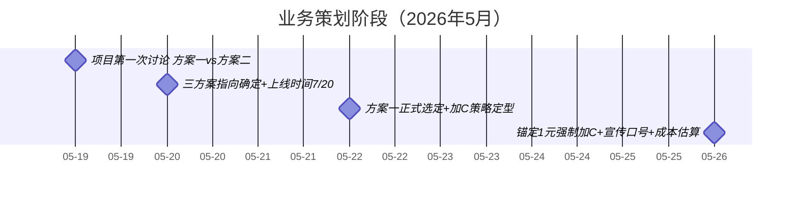
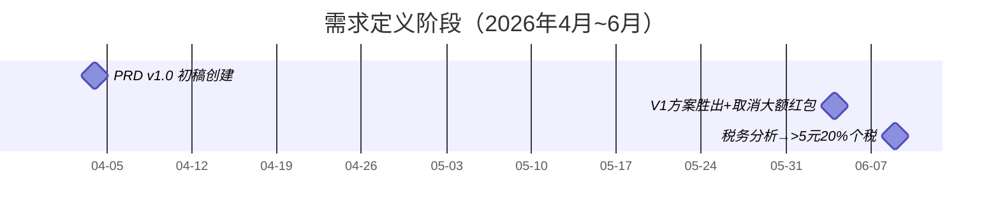
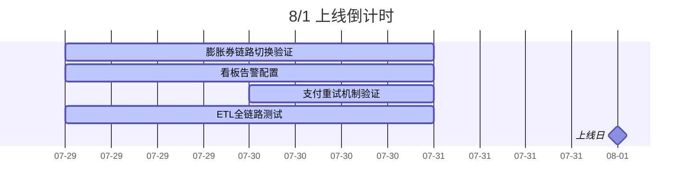

# 一物一码项目全生命周期地图

> 从 2026 年 4 月到 8 月上线的完整经历，串联需求→设计→开发→上线冲刺四个阶段

---

## 第一阶段：业务策划（5月17日~5月26日）

> 从零到一：活动机制讨论、三方案对决、预算与税务定调



| 时间 | 事件 | 关键决策 | 金句 |
|:---|:----|:--------|:----|
| **05-19** | **项目第一次讨论** 🥇 | 方案一胜出：只拿红包→小额可膨胀，用户理解成本低 | 「如果要让用户理解成本低且操作成本低，方案一肯定是最优选」 |
| **05-20** | 三方案指向确定 | ①导向加C ②导向复购不一定加C ③促进第一批销售；**上线时间首定 7/20** | 「整个项目缺统筹方，目的不明确，意味着没有人为结果负责」 |
| **05-22** | **方案一正式选定** 🏆 | 送门店咖啡券+加C；红包策略调整（极享兜底券降至60%，0.5元红包升至25%）；预计沉淀**60万企微好友** | 「加C不是难事，加完C以后不被退C，才是本事」 / 「先有效果，再去讲效率」 |
| **05-26** | 加C策略定型 | **锚定方案三**：1元红包强制加C、0.5元强制加C测试一个月；宣传口号三选一；8600万瓶营收约2.3亿 | 「生意是干出来的，不是算出来的」 |

---

## 第二阶段：需求定义 + 规则细化（4月~6月上旬）

> PRD 版本迭代 + 活动规则讨论 + 预算与税务驱动方案调整



| 时间 | 事件 | 产出 | 关键人 |
|:---|:----|:----|:-----|
| 04-04 | PRD 初稿 | 复购红包活动需求文档 v1.0 | 麻孜凯 |
| 04-09 | 后端技术方案初版 | V26.4.1 技术方案 v0.1.0-alpha | 蔡鸿东 |
| 04-14 | PRD v1.1 | 膨胀倍数放奖品行、GS编码定商品范围、窜货展示、黑名单统一风控 | 麻孜凯 |
| 04-17 | **PRD v1.2** | **去掉地址授权步骤**（体验优化决策） | 麻孜凯 |
| 04-22 | PRD v1.3 | 增加多活动判断、加C专题页跳转 | 麻孜凯 |
| 04-28 | PRD v1.4 | 增加单用户参与次数和每日次数限制（风控兜底） | 麻孜凯 |
| **06-04** | **V1 vs V2 方案对决** ⚔️ | **V1 胜出**：取消99元/9.9元大额红包，前三档无膨胀，预算956万→870万；**AB测试设计**（A组加C/B组复购二评）；7/3量产确认 | 团队 |
| **06-09** | **税务分析** 💰 | **>5元红包20%个税**→直接驱动6/11策略会取消大额红包方案；免费门店券同征20%个税；即享券（15元）作为销售折扣无额外税负 | 税务团队 |

> 📌 **关键决策链：** 税务分析（06-09）→ 取消大额红包 → 推动 06-11 规则调整 → 最终定型"小额现金+膨胀券"模式
>
> **AB 测试设计：** A组=加C链路，B组=复购二评链路——这是你之前发的 AB 分组规则表的前身

---

## 第三阶段：设计细化（5月~6月）

| 时间 | 事件 | 产出 | 关键人 |
|:---|:----|:----|:-----|
| 05-08 | 易全接口规范完成 | 易全同步瓶内码信息接口 | 蔡鸿东 |
| 05-14 | PRD v1.5（大版本） | 咖啡优惠券+库券、部分膨胀、易全接口确认、瓶身码与盖内码联动 | 麻孜凯 |
| 05-26 | PRD v1.6 | 奖品发放方式、膨胀多张券、加C获得/直接获得 | 麻孜凯 |
| 06-08 | 活动规则 v1 | 6 级奖品结构（365张→0.5元红包），首次明确"随机分配加C或复购" | 团队 |
| **06-11** | **活动规则 v2** 🔄 | **中奖率全面调整**（三等奖0.002%→0.5%，四等奖14%→20%，五等奖23%→39%，六等奖60%→40%）；膨胀奖品增加 **6.6元券**档次 | 团队 |

> 📌 **关键变化（06-08→06-11）：** 三天内大幅调整了中奖率分布——降低了最高奖概率但大幅提升了小额红包的中奖率，膨胀奖品增加了中间档次（6.6元）
>
> **vault 对应：** 原始纪要 → `活动规则-一物一码活动规则0608.md`、`活动规则-一物一码活动规则0611.md`

---

## 第四阶段：开发迭代（6月）

| 时间 | 事件 | 产出 | 关键人 |
|:---|:----|:----|:-----|
| 06-09 | 瓶内营销二期 PRD v1.0 | 膨胀体验优化：效果大图、多奖品Tab、概率配置、奖品重发 | 麻孜凯 |
| 06-26 | 二期 v1.1 | **删除复购领取按钮**（流程简化） | 麻孜凯 |
| 06-09~30 | 项目会议纪要持续 | 原始纪要 14 篇 | Jacob |

---

## 第五阶段：上线冲刺（7月）

| 时间 | 事件 | 产出 | 关键人 |
|:---|:----|:----|:-----|
| 07-13 | 核心业务事项推进 | 决策提炼：即享业务事项、红包膨胀券数据需求 | 用户+团队 |
| 07-14 | 内测评审 | 瓶内营销活动内测评审 | 团队 |
| 07-15 | **商品码 30 状态确认** | 码状态=30（已出货）才算有效可参与 | 用户+蔡鸿东 |
| 07-22 | **⚠️ 膨胀券链路切换** | C端发券接口 → **企业卡券系统**（重大技术转向） | 蔡鸿东 |
| 07-25 | 数据字典13张表建成 | ODS/DWD/DWS/ADS 全链路覆盖 | — |
| 07-26 | 上线盯防 | 上线风险监控与盯防清单 | 用户 |
| **07-29** | **文档全面补强** | 后端方案+PRD+二期+易全接口+9张图→15文件更新 | Hermes |

### 4 次关键决策

```
① 商品码30状态（07-15）
   码状态=30才算有效，码状态对不上活动的产品不参与
   
② 膨胀券链路切换（07-22）
   C端发券接口 → 企业卡券系统（重大技术转向）

③ 数据字典13表建成（07-25）
   ODS/DWD/DWS/ADS 全链路覆盖

④ 上线风险监控（07-26）
   扫码量、中奖率、支付失败率 P0 告警
```

### 涉及 vault 全量文档

| 目录 | 文件数 | 说明 |
|:----|:-----|:----|
| 01-原始纪要 | 39 篇 | 6 份大文档 + 33 篇会议纪要 |
| 02-业务视角 | 9 篇 | 时间线→用户旅程→运营配置+卡点+复盘 |
| 03-技术视角 | 6 篇 | 架构→状态机→交互→卡点→容错→领域模型 |
| 04-数据视角 | 5 篇 | 链路→字段→断链→卡点→看板检查 |
| 05-决策提炼 | 4 篇 | 4 次关键决策记录 |
| 06-复盘升华 | 9 篇 | 方法论+认知+交接手册+Jacob 5篇+时间线 |
| 07-项目全景 | 4 篇 | 索引+纪要继续+全景笔记+盯防清单 |

> 共计 **74 篇**（已全部填充）

---

## 上线前检查清单



> 📌 详细待办见 `07-项目全景/2026-07-26-一物一码8-1上线盯防风险监控.md`

---

## 参与角色

| 角色 | 人 | 职责 |
|:----|:--|:----|
| 💼 **产品经理** | 麻孜凯 | PRD 编写、需求演进（v1.0→v1.6→二期） |
| 🔧 **后端开发** | 蔡鸿东 | 技术方案、系统设计、易全对接 |
| 📝 **项目助理** | Jacob | 会议纪要、每日复盘、5 篇阶段复盘 |
| 👤 **运营负责人** | 刘晋泽 | 决策拍板、数据看板、风控策略 |
| 💰 **支付系统** | 王鑫 | 微信打款对接、商家转账到零钱 |
| 🔗 **三方供应商** | 易全科技 | 五码系统（生成→打印→关联→防窜货） |
| 🔗 **三方供应商** | 企业卡券系统 | 膨胀券发放与核销（7/22确认接入） |

---

> 关联：[[一物一码索引]] · [[一物一码纪要索引]] · [[一物一码项目全景笔记]]
